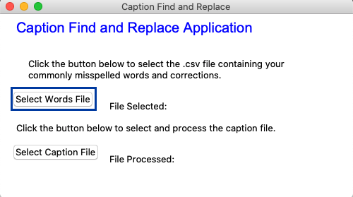
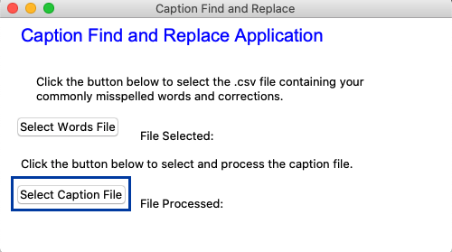

# Caption Find and Replace

The Caption Find and Replace application finds consistently mis-spelled/mis-understood words from computer generated caption files (from Zoom, WebEx or other tools) and replaces them with corrected words. Using a user-generated .csv file the application creates a dictionary of consistently mis-spelled/mis-understood words and their corresponding correct words. The user then selects a caption file to process. The application uses the uploaded word list to find and replace any of the incorrect words found in the caption file. This application was written with closed caption files in mind but could be used on any text file.

On application launch the user is presented with an interface to select a words file or process a caption file. If this is the first time the application has been run or if the user has added more words to their list, they will need to choose the Select Words File option.
&nbsp;

&nbsp;
Once a words file has been selected, the next option is to process the caption file.
&nbsp;

&nbsp;
A notification window will pop up notifying the user that the file has been processed. The notification will auto-close after 5 seconds and the application will close 3 seconds after that.
